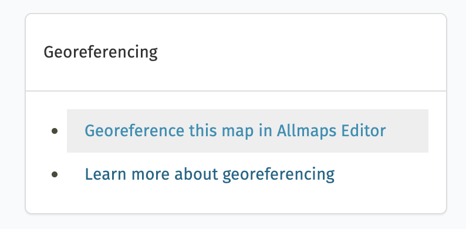

Test!!!



<!-- ## [here.allmaps.org](https://here.allmaps.org)

Go to [here.allmaps.org](https://here.allmaps.org) in your browser and, if prompted, allow the website to access your location.

The maps returned are maps that have been **georeferenced** using the Allmaps platform. They're all maps held in digital collections—for example,
the [AGSL Digital Map Collection](https://uwm.edu/lib-collections/agsl-digital-map-collection/).
In fact, any map in our collection can be used, and so can maps from any collection that uses **IIIF**, the **International Image Interoperability Framework**. -->

## Georeferencing

[Georeferencing](https://en.wikipedia.org/wiki/Georeferencing) is the process of overlaying a digital image on a map by matching pixels on the image to real geographic locations. This is commonly done with aerial and satellite photography to transform photographs into usable spatial data. It's also used to overlay historic maps on modern maps and compare change over time.

## Why should you care about georeferencing?

Georeferencing scanned maps enables powerful spatial analysis. For example, you can:

1. Extract information from a map, such as locations of topographic features like villages, mountains, rivers, or roads
2. Compare or verify features by overlaying two maps
3. Create a *mosaic* for viewing multiple sheets at once in large map series

The Leventhal Center uses georeferencing of urban atlases in our [Atlascope](https://atlascope.org) tool. Our team has georeferenced and mosaiqued over **137** urban atlases in the greater Boston area, making it easy to compare change over time across dozens of Massachusetts towns.

|  |
|:-:|
| *Fig. 1: [Screenshot of Atlascope](https://atlascope.org)* |

LMEC is in good company with many other institutions doing exciting work with georeferenced maps.

Our colleagues at the [American Geographical Society Library](https://uwm.edu/libraries/agsl/) (AGSL) at the University of Wisconsin-Milwaukee used Sanborn fire insurance maps to create a [Sanborn Web Map](https://webgis.uwm.edu/agsl/sanborn/). They've also georeferenced aerial photography in their [Operation Birds Eye](https://uwm.maps.arcgis.com/apps/webappviewer/index.html?id=4e066bb8e5664d189ac3e77c26d21712) discovery application.

|  |
|:-:|
| *Fig. 2: [Operation Bird's Eye](https://uwm.maps.arcgis.com/apps/webappviewer/index.html?id=4e066bb8e5664d189ac3e77c26d21712)* |

## How do people georeference maps?

Traditionally, georeferencing has been done using **GIS** or "geographic information systems." Georeferencing in GIS requires downloading software (like QGIS or ArcGIS Pro) and retrieving source files. For more detailed background, see [*Georeferencing and Georectification*](https://gistbok-topics.ucgis.org/DC-01-030) in the GIS&T Body of Knowledge.

Thanks to modern web-mapping tools, the process of georeferencing is more accessible to non-experts. For instance, the platform [OldInsuranceMaps.net](https://oldinsurancemaps.net/)---designed and built by Adam Cox---provides an interface for crowdsourced georeferencing of Sanborn maps across the entire United States.

|  |
|:-:|
| *Fig. 3: [OldInsuranceMaps.net](https://uwm.maps.arcgis.com/apps/webappviewer/index.html?id=4e066bb8e5664d189ac3e77c26d21712)* |

In this lesson, we'll be using [Allmaps](https://allmaps.org), a web-based georeferencing tool, to get started with georeferencing. The Allmaps software depends on something called [IIIF](https://iiif.io)---but what does *that* mean?

## What is IIIF?

**IIIF** (pronounced "triple-eye-eff"), or the [International Image Interoperability Framework](https://iiif.io/),
is a set of open standards for delivering high-quality, attributed digital objects online at scale.

IIIF provides a consistent way for institutions to share digital images, maps, manuscripts, artworks, and even audio/visual files across different platforms.
Rather than locking media inside specific viewers or software tools, IIIF offers a **standardized, flexible way** to deliver these resources to any compatible application.

This means:

1. A digitized map from one library can be viewed side-by-side with one from another institution.
2. A scholar can annotate or compare high-resolution images without downloading large files.
3. Tools like [Allmaps](https://allmaps.org/), [Mirador](https://projectmirador.org/), and [Universal Viewer](https://universalviewer.io/) can all read the same IIIF content.

At its core, IIIF enables *interoperability*, making it easier for cultural heritage institutions, educators, and developers to build rich user experiences around media from all over the world.



## Finding IIIF maps to use in Allmaps

**Allmaps** works great with large-scale maps like city, county, state, or country maps.
While it’s possible to georeference small-scale maps (like world maps), distortion introduced by the georeferencing process can make them harder to work with.

Any map hosted using IIIF will work in Allmaps.
The IIIF Consortium [lists some collections](https://iiif.io/guides/finding_resources/) including:
- [Library of Congress](https://www.loc.gov/maps)
- [The David Rumsey Map Collection](https://www.davidrumsey.com/luna/servlet/view/all)
- [UWM AGSL](https://uwm.edu/lib-collections/agsl-digital-map-collection/)

If you launch the [Allmaps Editor](https://editor.allmaps.org), you'll see maps hosted by various Allmaps partners (including LMEC) that are waiting to be georeferenced.

To georeference a map from LMEC, simply pick a map from the [Center's digital collections portal](https://collections.leventhalmap.org/) and select "Georeference this map in Allmaps Editor" on the right-hand side of the screen.

|  |
|:-:|
| *Fig. 4: Allmaps direct from LMEC collections* |

Other websites may require more sleuthing to find the manifest. On the David Rumsey Collection, it's listed under the **share** menu.

|  |
|:-:|
| *Fig. 5: IIIF manifest in Rumsey collections* |

If it’s not visible, tools like the [DetektIIIF browser extension](https://seige.digital/en/detektiiif/) can help.

###### [Next lesson ↪](../lesson-2)