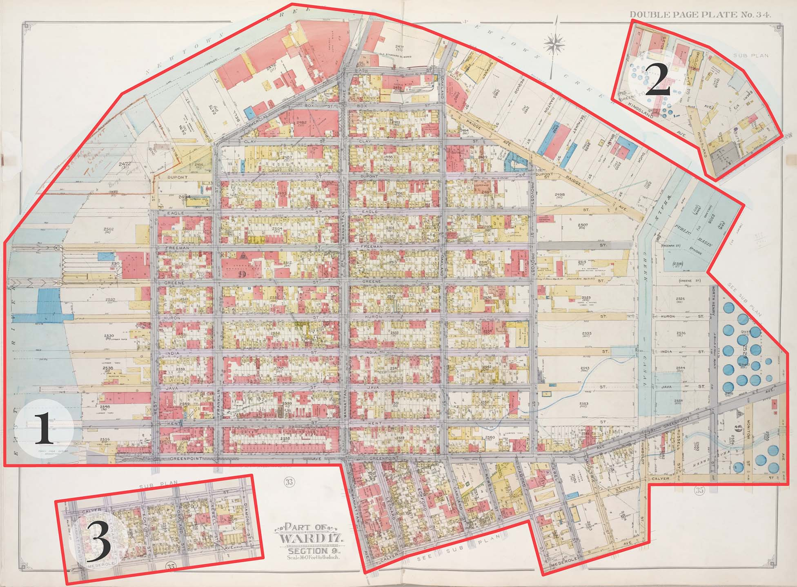
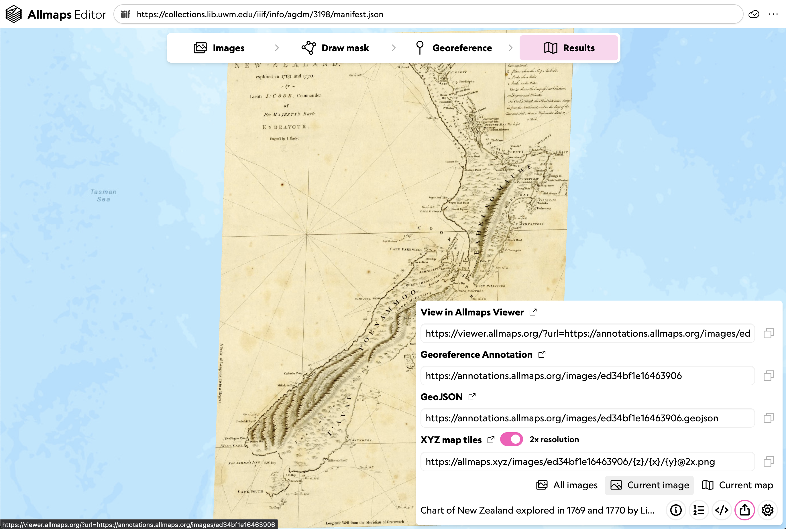



## Allmaps Editor

If you haven't already, launch the Allmaps Editor by going to [editor.allmaps.org](https://editor.allmaps.org).

You can choose a map by either:

1. Entering a **IIIF Manifest URL** in the text box at the top of the page
2. Scrolling down to find a map in one of the highlighted collections


## Masking

The first step is adding a **mask**. This involves drawing a line around the "map" areas of the document to exclude the collar or marginalia. In other words, you're identifying the part of the scanned image that you want to actually overlay.

Use the **Draw Mask** tab to add a mask. Click to add points, and double-click to close the polygon. If you mess up, click **Cancel** to start over.




It's possible your image includes multiple maps! Each map gets its own mask.



Much of the time, your mask will simply be a rectangle drawn just inside the map's neatline.


## Ground Control Points

Ground control points---also known as **GCPs**---guide Allmaps in aligning the scanned image (left side) with real-world geography (right side).

Use the **Georeference** tab to begin placing GCPs. To create one, find a location that clearly matches on both sides—such as a street intersection or the corner of a recognizable building. Click the same spot on both images.


Because we will be focusing in this workshop on urban atlases, consider the following best practices for georeferencing them:

- **Avoid water bodies**: they change too much over time to be reliable.
- **Use roads and buildings**: as long as they haven’t been torn down or significantly altered.
- **Check your progress**: sometimes only a few GCPs are needed. Too many can actually introduce unwanted distortion. A good check-in is after placing 5–10 points.




## What is this doing?

Behind the scenes, placing GCPs in Allmaps creates a **Georeference Annotation**:


A [Georeference Annotation](https://iiif.io/api/extension/georef/) is a standard format for storing geospatial information associated with a IIIF image. The Annotation specification is maintained by the [IIIF Consortium](https://iiif.io).

Each point creates a pair of values:
- **Resource coordinates**: pixel location in the image (e.g. 3017, 4367)
- **Geometry coordinates**: geographic location in longitude/latitude (e.g. 172.936215°E, 43.7589394°S)

Allmaps uses this data to calculate the warping or stretching needed to align the image over the map. 6-digit coordinate precision is probably overkill, but hey---it gives us an excuse to use [one of our favorite xkcd comics](https://xkcd.com/2170) :)

## Example georeference annotation

Here's a full georeference annotation, excerpted from this "[scrimshaw map of Cape Cod](https://editor.allmaps.org/images?url=https%3A%2F%2Fcollections.leventhalmap.org%2Fsearch%2Fcommonwealth%3Amc87sd17s%2Fmanifest&image=https%3A%2F%2Fiiif.digitalcommonwealth.org%2Fiiif%2F2%2Fcommonwealth%3Azc77wd40b)" in LMEC's collections.

Take a moment to inspect this. Can you make sense of what each `key` (or the red text) and each `value` (or the purple and yellow text) is communicating?

```json
{
  "type": "AnnotationPage",
  "@context": "http://www.w3.org/ns/anno.jsonld",
  "items": [
    {
      "id": "https://annotations.allmaps.org/maps/d4c61e6dcd17aae5",
      "type": "Annotation",
      "@context": [
        "http://iiif.io/api/extension/georef/1/context.json",
        "http://iiif.io/api/presentation/3/context.json"
      ],
      "motivation": "georeferencing",
      "target": {
        "type": "SpecificResource",
        "source": {
          "id": "https://iiif.digitalcommonwealth.org/iiif/2/commonwealth:zc77wd40b",
          "type": "ImageService2",
          "height": 5585,
          "width": 4262
        },
        "selector": {
          "type": "SvgSelector",
          "value": "<svg width=\"4262\" height=\"5585\"><polygon points=\"0,0 0,5585 4262,5585 4262,0\" /></svg>"
        }
      },
      "body": {
        "type": "FeatureCollection",
        "transformation": {
          "type": "polynomial",
          "options": {
            "order": 1
          }
        },
        "features": [
          {
            "type": "Feature",
            "properties": {
              "resourceCoords": [
                2675,
                1197
              ]
            },
            "geometry": {
              "type": "Point",
              "coordinates": [
                -70.204922,
                42.0251759
              ]
            }
          },
          {
            "type": "Feature",
            "properties": {
              "resourceCoords": [
                1905,
                3259
              ]
            },
            "geometry": {
              "type": "Point",
              "coordinates": [
                -70.3489129,
                41.7205662
              ]
            }
          },
          {
            "type": "Feature",
            "properties": {
              "resourceCoords": [
                209,
                4497
              ]
            },
            "geometry": {
              "type": "Point",
              "coordinates": [
                -70.6671407,
                41.5266715
              ]
            }
          }
        ]
      }
    }
  ]
}
```

## Results

The **Results** tab gives you a preview of the map with georeferencing applied. It's a great way to check alignment and see if you're on the right track.


In the bottom right-hand corner of the interface, you’ll see **Drawers** with more tools. From left to right, each **Drawer** includes:

1. **Information**: shares metadata about the IIIF resource
2. **GCP List**: lists all your points; delete ones that don't work
3. **Code**: shows the actual Georeference Annotation (JSON format). You can copy and reuse this in the Viewer.
4. **Share**: provides...
   - A link to view in Allmaps Viewer
   - A link to the annotation
   - A `GeoJSON` download
   - An XYZ tile link (usable in web maps or GIS software)



We'll explore the Viewer in the next lesson. For now, click the **View in Allmaps Viewer** link in the share menu to continue.

###### [↩ Back to Lesson 1](../lesson-1)
###### [On to Lesson 3 ↪](../lesson-3)