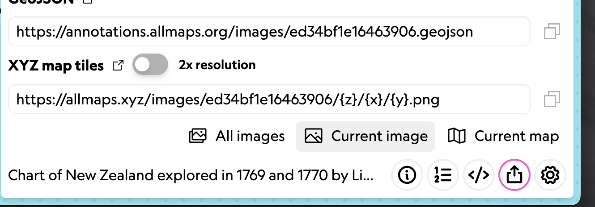



## Allmaps Viewer

[Allmaps Viewer](https://viewer.allmaps.org) is used to view georeferenced maps in Allmaps. Similar to the **Results** tab in the Editor, you can see the map overlaid on a web map.
The Viewer also includes **additional tools** that let you customize the appearance and functionality of your map.

Common tools (found at the bottom of the screen) include sliders that control **layer transparency/opacity** and **background removal**.

Background removal is especially useful with historical maps—it removes the blank paper and allows the cartographic information to shine.

Keyboard shortcuts:

- `Space` – Toggle transparency on/off
- `B` – Toggle background removal
- `M` – Display the mask
- `T` – Change the transformation algorithm
- `G` – Display a grid over the image
- `D` – Cycle display of distortions: surface deformation, angle distortion, or none

## Viewing Mosaiqued Atlas Plates

IIIF manifests often contain objects with multiple maps. Atlases are the quintessential example.

At LMEC, we use Allmaps to work with atlases all the time. Check out this [atlas of Braintree, MA](https://editor.allmaps.org/images?url=https://www.digitalcommonwealth.org/search/commonwealth:xk81nf82h/manifest) in Allmaps Editor, georeferenced by former LMEC interns. Green indicates sheets that are already georeferenced, and the number indicates the number of masks associated with that map image:



Try [opening this atlas in Allmaps Viewer](https://editor.allmaps.org/images?url=https://www.digitalcommonwealth.org/search/commonwealth:xk81nf82h/manifest) to see how stitched maps are displayed.

As a reminder, you can open a map in Allmaps Viewer using the **Drawers** in the bottom right-hand side of the screen.

When working with multi-sheet objects, the following keystrokes might help:

- `[` and `]`: Cycle through maps
- `Right Click`: Change map layer order

## Changing the Transformation Algorithm

As we covered in [Lesson 2](../lesson-2), ground control points (GCPs) define locations where features match across old and new maps. A transformation algorithm uses these points to warp the image accordingly.

Cycle through algorithms using `T`.

Different algorithms will produce different results. Some algorithms, like **Thin Plate Spline**, will stretch and distort the image more than others, while algorithms like **Polynomial** maintain a high threshold for distortion:

You can set the **transformation type**

## Mosaiquing an atlas together

Now let's try georeferencing and mosaiquing an atlas together! We'll use [this atlas of Springfield, MA](https://collections.leventhalmap.org/search/commonwealth:v692xc23q) as an example. 

**First**, open the atlas in [Allmaps Editor](https://editor.allmaps.org). You can either paste the IIIF manifest (`https://ark.digitalcommonwealth.org/ark:/50959/v692xc23q/manifest`) into Allmaps Editor, or simply click the "Georeference this map in Allmaps Editor" button from the object record page.

**Second**, visit this [Google Sheet](https://docs.google.com/spreadsheets/d/13KE01w5JwW4Eliabg8qPfmqmJz59M2_2whcW3O6luv4/edit?gid=0#gid=0) and claim an atlas plate to georeference. Depending on how many people are in the workshop, you may be able to claim more than one.

When choosing a plate:
1. You don't want to georeference the title sheets or index sheet
2. Use the `image #` underneath each map image as the indicator of which sheet you have chosen

**Third**, georeference your map(s)! Follow the best practices for GCPs described in [Lesson 2](../lesson-2#ground-control-points).

**Finally**, when everybody is one, we'll view the finished product in Allmaps Viewer.

## Using XYZ tiles in QGIS

Allmaps provides a free **XYZ tile server**, allowing you to bring georeferenced maps directly into GIS software like QGIS.

In **QGIS**, use the **Add XYZ Layer** tool:

Copy the **XYZ Tile URL** from the Allmaps Editor Share tools:

Then create a new XYZ Connection in QGIS and paste in the URL. No other changes are usually needed.

Now you can use your georeferenced map directly in desktop GIS!

You can even use the **Export** tool to save the result as a **GeoTIFF**, a standard format for georeferenced images.

More info on the Allmaps Tile Server is available in this [Observable notebook](https://observablehq.com/@allmaps/allmaps-tile-server).

## More You Can Do

What will *you* do with your georeferenced maps?

Here are just a few exciting examples:

- [Stories from Urban Atlases of Waltham](https://www.leventhalmap.org/articles/waltham-urban-atlas-essays/)
- [Atlascope](https://www.atlascope.org/)
- [Architectural Drawings in Allmaps](https://viewer.allmaps.org/?url=https%3A%2F%2Fsammeltassen.nl%2Fiiif-manifests%2Fallmaps%2Frivierahal-blijdorp.json)
- [Georeferenced Aerial Photographs](https://viewer.allmaps.org/?url=https%3A%2F%2Fannotations.allmaps.org%2Fimages%2F4bcc9463d2a68df4)

To go even further, explore the collection of [Allmaps Observable Notebooks](https://observablehq.com/@allmaps):

- Use IIIF maps in MapLibre, Leaflet, or OpenLayers
- Draw vector **GeoJSON** layers on top of Allmaps
- Georeference based on **toponyms** (place names)
- Learn more about the **code and architecture** of Allmaps

###### [↩ All lessons](../)

###### [↩ Home](../../)